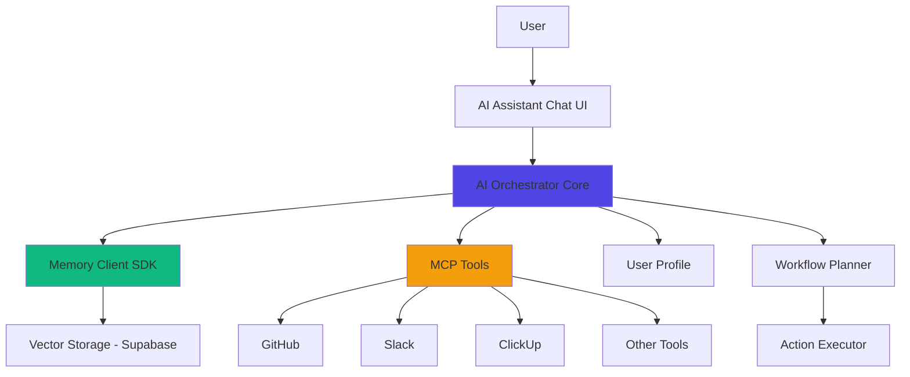

# AI Orchestrator - Complete Setup Guide

## 🎉 What's Been Built

A **fully functional AI Agent/Orchestrator** embedded in the dashboard that provides:

### ✅ Core Features
1. **Memory Recall** - Semantic search through vector storage
2. **Workflow Creation** - AI-powered multi-step planning
3. **Context Storage** - Persistent memory across sessions
4. **Personalization** - User profile-based responses
5. **MCP Integration** - Connect to personal productivity tools
6. **Cross-Platform** - Works across CLI, dashboard, API, SDK, IDE extensions

---

## 📁 File Structure

```
/apps/dashboard/
├── src/
│   ├── lib/
│   │   ├── memory-sdk/              ← Memory Client (copied from base SDK)
│   │   │   ├── client.ts
│   │   │   ├── enhanced-client.ts
│   │   │   ├── types.ts
│   │   │   ├── dashboard-adapter.ts  ← Dashboard-specific wrapper
│   │   │   └── index.ts
│   │   │
│   │   └── ai-orchestrator/          ← AI Orchestrator Core
│   │       └── core.ts               ← Main AI engine
│   │
│   ├── hooks/
│   │   ├── useMemoryClient.tsx       ← Memory hook
│   │   └── useAIOrchestrator.tsx     ← AI orchestrator hook
│   │
│   ├── components/
│   │   └── ai/
│   │       └── AIAssistant.tsx       ← Floating chat interface
│   │
│   └── App.tsx                       ← AI Assistant integrated here
```

---

## 🧠 Architecture Overview



---

## 🚀 How It Works

### 1. **User Sends Message**
```typescript
// User types: "Create a workflow to analyze Q3 sales data"
const { sendMessage } = useAIOrchestrator();
await sendMessage("Create a workflow to analyze Q3 sales data");
```

### 2. **AI Orchestrator Processes**
```typescript
// core.ts - processRequest()
1. Recall relevant memories (semantic search)
2. Detect intent (workflow creation)
3. Generate multi-step plan
4. Store conversation context
5. Return response + workflow
```

### 3. **Memory Integration**
```typescript
// Searches vector storage for relevant context
const memories = await memoryClient.search({
  query: userInput,
  limit: 10,
  threshold: 0.7
});

// Uses memories to enhance response
```

### 4. **Workflow Creation**
```typescript
// Creates structured workflow plan
{
  id: "wf_123",
  goal: "Analyze Q3 sales data",
  steps: [
    { label: "Gather data", tool: "database" },
    { label: "Analyze trends", tool: "analytics" },
    { label: "Create report", tool: "documents" }
  ],
  usedMemories: ["mem_1", "mem_2"]
}
```

---

## 🔌 MCP Integration (Personal Tools)

### Connecting User's Tools

The AI orchestrator can connect to personal productivity tools via MCP:

```typescript
// lib/ai-orchestrator/mcp-connector.ts (TO BE CREATED)

import mcpServers from '@/config/mcp-servers.json';

export class MCPConnector {
  async executeAction(tool: string, action: string, params: any) {
    // Execute actions via MCP tools
    // Examples:
    // - GitHub: Create issue, commit code
    // - ClickUp: Create task, update status
    // - Slack: Send message, create channel
    // - Notion: Create page, update database
  }
}
```

### Example MCP Actions

```typescript
// Create GitHub issue
await mcp.executeAction('github', 'create-issue', {
  title: 'Bug fix needed',
  body: 'Details from AI analysis...'
});

// Create ClickUp task
await mcp.executeAction('clickup', 'create-task', {
  name: 'Q3 Report',
  description: 'Generated by AI orchestrator'
});

// Send Slack message
await mcp.executeAction('slack', 'send-message', {
  channel: '#team',
  text: 'Workflow completed!'
});
```

---

## 💾 Persistent Memory Across Platforms

### Cross-Platform Session Management

```typescript
// Shared memory across:
// - Dashboard (web)
// - CLI tools
// - IDE extensions (VSCode, Cursor, Windsurf)
// - Web extensions
// - Mobile apps

// All platforms use the same memory API
const memoryClient = new MemoryClient({
  apiUrl: 'https://api.lanonasis.com/memory',
  apiKey: userToken
});

// Store context
await memoryClient.create({
  title: 'User preference',
  content: 'Always use TypeScript for new projects',
  type: 'personal',
  tags: ['preference', 'typescript']
});

// Retrieve across any platform
const memories = await memoryClient.search({
  query: 'typescript preferences'
});
```

### Session Sync

```typescript
// lib/ai-orchestrator/session-sync.ts (TO BE CREATED)

export class SessionSync {
  // Sync conversation history across devices
  async syncSession(sessionId: string) {
    // Upload local session to cloud
    // Download latest from cloud
    // Merge conversations
  }

  // Continue conversation on different platform
  async resumeSession(sessionId: string) {
    // Fetch conversation history
    // Restore AI context
    // Continue where user left off
  }
}
```

---

## 🎨 UI/UX Features

### Floating AI Assistant

```typescript
// Always accessible via floating button
<AIAssistant />

// Features:
- Minimize/maximize
- Persistent across page navigation
- Auto-saves conversation
- Suggested actions
- Real-time typing indicators
```

### Chat Interface

```
┌─────────────────────────────────┐
│ 🧠 AI Assistant        [-][x]   │
├─────────────────────────────────┤
│                                 │
│ User: Create a workflow         │
│       for Q3 analysis          │
│                                 │
│ AI: I've created a 3-step      │
│     workflow. Here's the plan: │
│     1. Gather Q3 data          │
│     2. Analyze trends          │
│     3. Generate report         │
│                                 │
│ [Try asking:]                   │
│ • Execute workflow             │
│ • Tell me more                 │
│                                 │
├─────────────────────────────────┤
│ Ask me anything... [Send]      │
└─────────────────────────────────┘
```

---

## 🔧 Configuration Required

### Environment Variables

```bash
# .env
VITE_MEMORY_API_URL=https://api.lanonasis.com/memory
VITE_ANTHROPIC_API_KEY=sk-ant-xxx  # For AI processing
VITE_OPENAI_API_KEY=sk-xxx         # For embeddings
```

### MCP Configuration

```json
// config/mcp-servers.json
{
  "mcpServers": {
    "github": {
      "command": "npx",
      "args": ["-y", "@modelcontextprotocol/server-github"],
      "env": {
        "GITHUB_PERSONAL_ACCESS_TOKEN": "ghp_xxx"
      }
    },
    "clickup": {
      "command": "npx",
      "args": ["-y", "clickup-mcp"],
      "env": {
        "CLICKUP_API_KEY": "pk_xxx"
      }
    }
  }
}
```

---

## 📊 Usage Examples

### Example 1: Create Workflow

```typescript
const { createWorkflow } = useAIOrchestrator();

const workflow = await createWorkflow(
  "Analyze our API usage and create optimization report"
);

// Returns:
{
  steps: [
    { label: "Fetch API logs", tool: "database" },
    { label: "Analyze patterns", tool: "analytics" },
    { label: "Generate report", tool: "documents" }
  ],
  usedMemories: ["mem_api_docs", "mem_optimization_tips"]
}
```

### Example 2: Store Context

```typescript
const { storeContext } = useAIOrchestrator();

await storeContext(
  "Our deployment schedule is every Friday at 5 PM PST"
);

// Later, AI will recall this automatically when relevant
```

### Example 3: Ask Questions

```typescript
const { askQuestion } = useAIOrchestrator();

const answer = await askQuestion(
  "What's our deployment schedule?"
);

// Returns: "Based on what I remember, your deployment
//           schedule is every Friday at 5 PM PST."
```

---

## 🎯 Next Steps

### Phase 1: Core (✅ Complete)
- ✅ AI Orchestrator Core Engine
- ✅ Memory Client Integration
- ✅ Chat UI
- ✅ Dashboard Integration

### Phase 2: MCP Integration (In Progress)
- 🔄 Connect MCP tools
- 🔄 Personal tool authentication
- ⏳ Action execution framework

### Phase 3: Cross-Platform (Pending)
- ⏳ Session sync across devices
- ⏳ CLI integration
- ⏳ IDE extension support
- ⏳ Web extension bridge

### Phase 4: Enhancements (Pending)
- ⏳ Voice input/output
- ⏳ Proactive suggestions
- ⏳ Workflow templates
- ⏳ Team collaboration

---

## 🚀 Launch Checklist

Before going live:

- [ ] Set up memory API endpoint
- [ ] Configure AI API keys (Anthropic/OpenAI)
- [ ] Test MCP tool connections
- [ ] Verify Supabase auth integration
- [ ] Test cross-browser compatibility
- [ ] Set up error monitoring
- [ ] Create user onboarding flow

---

## 📖 API Reference

See individual files for detailed API documentation:
- `lib/ai-orchestrator/core.ts` - Core AI engine
- `lib/memory-sdk/dashboard-adapter.ts` - Memory operations
- `hooks/useAIOrchestrator.tsx` - React hook API
- `components/ai/AIAssistant.tsx` - UI component

---

**🎉 Your AI Orchestrator is ready to help users across the entire platform!**
